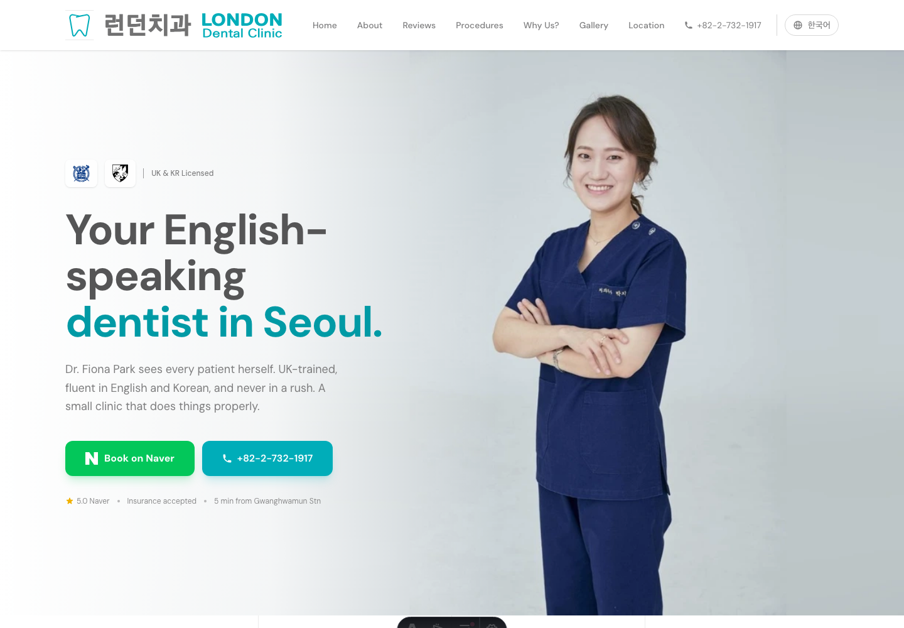
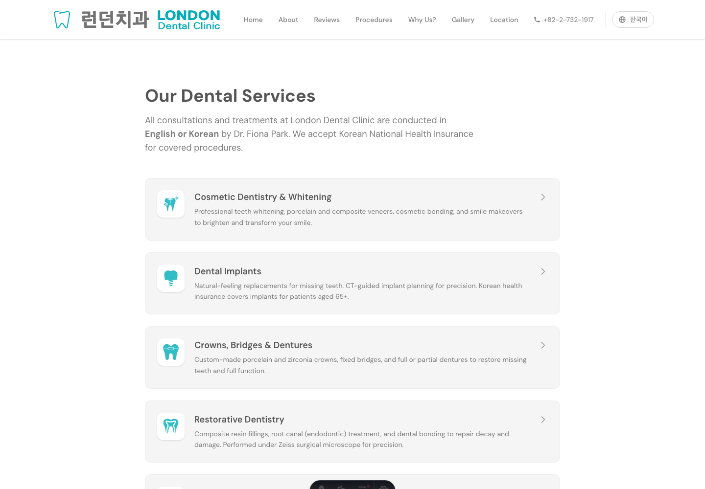

# London Dental Clinic Website



A bilingual Astro website for London Dental Clinic, an English-speaking dental clinic in Seoul. The project is a small, real production site focused on clear patient information, multilingual UX, local search visibility, and AI-era discoverability.

Live site: https://www.londondental.co.kr

## Screenshots

| Homepage | Services |
| --- | --- |
|  |  |

## Portfolio Read

This repo is presented as a public portfolio artifact for practical software/product work. It shows how I approach a real small-business problem: make a trustworthy service easy to understand, easy to book, easy for search engines to parse, and easy for humans or code agents to review.

My role covered product framing, site architecture, content structure, implementation, SEO/LLM discoverability, and verification hygiene. Coding agents were used as workflow leverage for exploration, implementation support, and review, while product direction, claims, privacy boundaries, and quality decisions stayed human-owned.

## Problem

London Dental Clinic serves Korean patients, expats, and visitors who may need dental care in English. The site needed to:

- Communicate trust quickly without overclaiming.
- Support English and Korean users with equivalent routes.
- Make booking, location, services, and first-visit information easy to find.
- Improve local SEO for Google/Naver and structured discovery by AI assistants.
- Keep healthcare-adjacent claims, patient reviews, and clinic assets inside clear public-use boundaries.

## What Is Implemented

- Astro static site with Tailwind CSS and content collections.
- English/Korean route prefixes with hreflang/canonical metadata.
- Markdown-backed pages for procedures, FAQ, equipment, first visit, privacy, and doctor profile.
- Reusable layout, header/footer, mobile booking bar, and responsive procedure modal.
- LocalBusiness/Dentist, FAQ, Breadcrumb, and WebSite JSON-LD.
- `robots.txt`, `_headers`, sitemap integration, and `llms.txt`/`llms-full.txt`/`llms-ko.txt`.
- Real clinic imagery and lightweight mobile-first booking/location flows.

## Architecture

The site is intentionally simple:

- `src/data/clinic.ts` is the canonical source for public clinic facts.
- `src/content/` holds typed Markdown content for pages and procedures.
- `src/pages/en` and `src/pages/ko` expose localized routes.
- `src/components/seo` owns metadata, structured data, and LLM discovery links.
- `public/` contains static assets, headers, robots, and LLM-facing text files.

See [docs/architecture.md](docs/architecture.md) for a deeper review map.

## Setup

Requires Node `22.12.0` or newer.

```sh
npm ci
npm run dev
```

Local dev server: http://localhost:4321

## Verification

```sh
npm run check
npm run build
npm run verify:dist
```

`npm run verify` runs the content/type check, production build, and post-build smoke checks for key routes, canonical/hreflang metadata, JSON-LD, LLM files, and generated sitemap output.

## Privacy And Asset Boundaries

This repository is intended for portfolio review, not as a reusable clinic template. Clinic copy, patient review excerpts, logos, photos, university emblems, and business details should not be reused without explicit permission.

See [PRIVACY_AND_ASSET_BOUNDARIES.md](PRIVACY_AND_ASSET_BOUNDARIES.md) for the public data and asset policy.

## Public Repo Notes

Recommended GitHub description:

> Bilingual Astro site for an English-speaking dental clinic in Seoul, with local SEO, structured data, and LLM discoverability.

Suggested topics:

`astro`, `tailwindcss`, `local-seo`, `bilingual`, `structured-data`, `llms-txt`, `static-site`, `portfolio`
